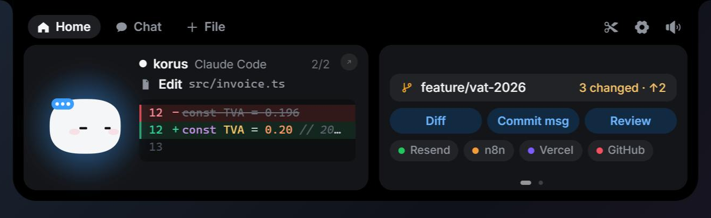
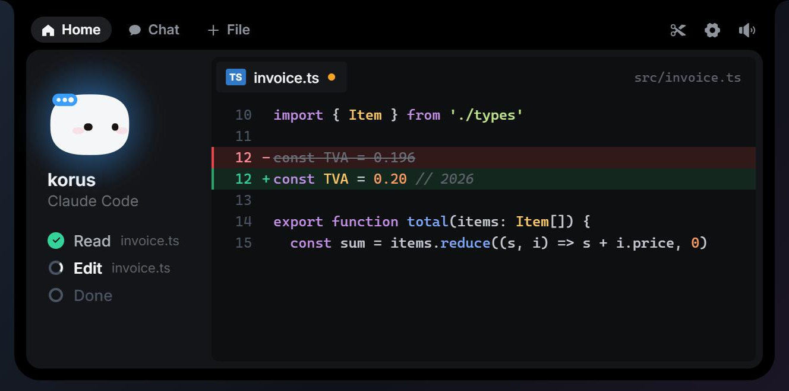
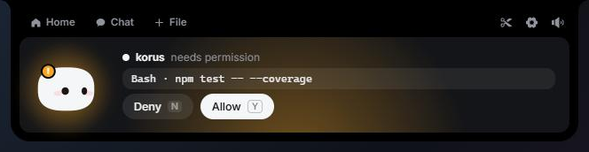
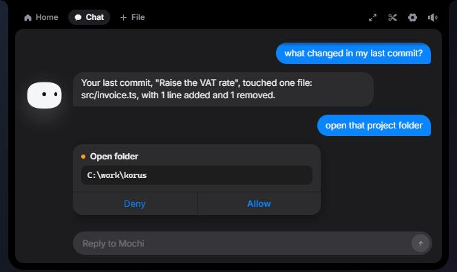
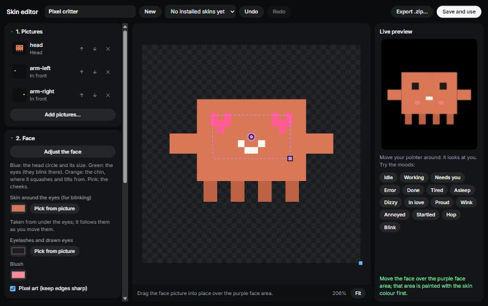
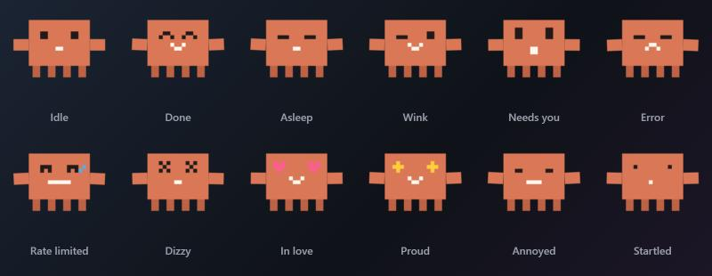
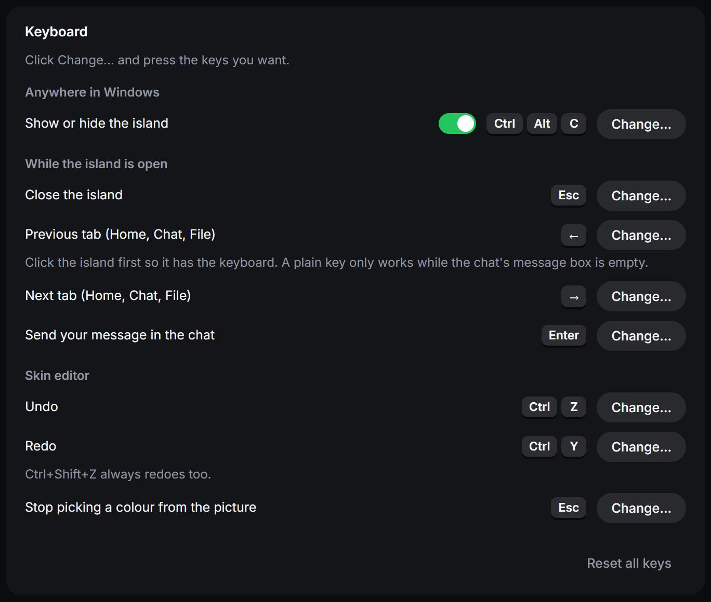

<div align="center">

# Coucou MOD

**A small always-on-top companion for AI coding sessions, redesigned for Windows.**

It shows what Claude Code is doing to your files while it does it, lets you approve its
permission requests with one click, and gives you a chat assistant that can act on your PC.
All of it lives in a slim island at the top edge of your screen that stays out of the way
until something needs you.




</div>

## What this fork is

Coucou MOD is a fork of [Coucou](https://github.com/Louis-CFM/coucou) by Louis Raillé. The
original is a macOS app that lives in the MacBook notch. A PC has no notch, so this fork
treats Windows as the primary target and redesigns the experience around that:

- **A summoned island, not a docked overlay.** It stays hidden, appears when Claude Code
  needs you or when you press a shortcut, and closes itself when you move on.
- **A Home screen about the work itself.** The current tool, the file it touches and a
  readable diff, then a full editor view one click away.
- **A chat that acts.** Claude or Gemini, with tools for your files, apps, media and
  PowerShell, each risky one gated by a card you approve.
- **Characters you can import or make.** A skin is a folder of PNG layers and a manifest.
  A built-in editor builds one from your own pictures, with a live preview.
- **Keyboard control you can change.** Every key the app listens to is listed in Settings and
  can be rebound.

The macOS sources are kept in `NotchBuddy/` as they were upstream. Everything described here
is in `windows/`.

## A tour

### Home: see the change as it happens

While Claude Code works, the left card names the project, the tool in use and the file it is
touching, with the lines it changed. Removed lines are struck through in red and added lines
are green, with syntax colours. A Read shows the top of the file. If the first tool is a
shell command, the card shows the command and the latest steps instead.

The right card follows the project: branch, number of changed files and commits ahead or
behind, plus one-click prompts for **Diff**, **Commit msg** and **Review**. Your configured
services appear as small chips under it. A second page shows your Claude Code usage: the
five-hour window in progress and the last seven days.

The pill is named after the editor you are working in (Cursor, VS Code, WebStorm and others),
found from the process that runs the session.

### Editor view

Click the card to open the whole change. The file tab carries a dot when the file is being
modified, the steps of the session run down the left, and a caret blinks on the line being
written.



### Approvals

When Claude Code asks for permission, the island opens on the request with the exact tool and
target. Allow or deny and carry on.



Nothing is ever approved without a click, and Coucou never blocks Claude Code: if the app is
closed, slow or crashed, its relay gives up within a fraction of a second and Claude Code asks
in the terminal as it normally does.

### Chat

The chat uses your own Anthropic or Google AI Studio key. Replies stream in as they are
written, the message box keeps the cursor while Mochi answers, and an attached file shows as
a chip you can remove with one click.



The assistant can act, not only answer:

| Runs straight away | Asks first, with a card showing exactly what will run |
|---|---|
| Coucou status, sound, island edge, pause, file picker, settings, integration dashboards, opening a link, pause or skip or volume through the media keys, playing a named song | Opening a folder or an app, listing a folder, reading a file, taking a screenshot, running a PowerShell command |

Commands start in your home folder, so the assistant is told to move into a project first. A
command that runs longer than a minute is stopped together with everything it started. An
unanswered card counts as a refusal after two minutes. The assistant cannot approve Claude
Code's own permission requests.

When you ask how to do something on your PC, it can walk you through it one step at a time and
point at the control to click.

### Files and screenshots

Drop a file on the island, paste an image, or use the scissors button to snip part of the
screen. The file is copied to a private inbox, Mochi plays the swallow animation, and the chat
opens with the file attached and ready for a question.

### Characters and the skin editor

The default character is Mochi. You can switch to the Ribbon variant, import a skin as a
`.zip` or a folder, or build one yourself.



Drop a picture of your character and the editor guesses the head, eyes and cheeks. Drag the
points into place, say which pictures swing or bend, optionally draw a face per mood, and
watch the real character engine wear it in the preview. A skin can also carry a chat
personality, and your own name from Settings fills in the `{{user}}` placeholder.



The format is data only, so an imported skin can never run code. See
[docs/SKINS.md](docs/SKINS.md) for the format and a sample you can generate.

### Keyboard

Every key the app listens to is in **Settings, Keyboard**, and each can be changed or reset.



| Key | Action |
|---|---|
| Ctrl + Alt + C | Show or hide the island from anywhere |
| Esc | Close the island |
| Left and Right | Previous and next tab (Home, Chat, File) |
| Enter | Send the chat message |
| Ctrl + Z, Ctrl + Y | Undo and redo in the skin editor |

The arrow keys need the island to have the keyboard: click it once. In the chat they switch
tabs only while the message box is empty, so they still move the text cursor when you are
typing.

## Install

There is no published installer from this fork yet, so you build it. It takes a few minutes
and installs for the current user, with no administrator prompt.

You need [Rust](https://rustup.rs), [Node 20 or newer](https://nodejs.org) and the
[Visual Studio Build Tools](https://visualstudio.microsoft.com/visual-cpp-build-tools/) with
the C++ workload. WebView2 ships with Windows 10 and 11.

```powershell
git clone https://github.com/vinkdc/coucou-MOD-.git
cd coucou-MOD-/windows
npm install
npm run pack
```

The installer lands in `windows/release/`. To run without installing, use
`windows/target/release/coucou.exe`, or start a live-reloading development build:

```powershell
npm run tauri dev
```

The app has no taskbar window. The island and the tray icon are all of it, and Quit is in the
tray menu.

## First run

1. Open the tray menu and choose **Settings**.
2. Under **Claude Code**, choose **Install hooks**. You see the exact diff to
   `%USERPROFILE%\.claude\settings.json` and the path of the dated backup before anything is
   written. Your own hooks are left alone, and uninstalling removes only Coucou's.
3. Add an Anthropic key under **Claude**, or a Google AI Studio key under **Gemini**, and pick
   which one answers. Keys go to the Windows Credential Manager and never to a file.
4. Optional: set **Your name**, pick a **Character**, add service keys, and turn on
   **Launch at startup**.

Start a new Claude Code session afterwards, in any terminal: Windows Terminal, PowerShell,
VS Code or Git Bash all work.

Other tools can get their own pill by adding a `coucou_agent` field to the hook payload, see
[docs/AGENTS.md](docs/AGENTS.md).

## Privacy

- No telemetry and no account.
- The app only contacts services you configured, with one addition: when you ask the
  assistant to play a song, it searches YouTube for it and opens the first result.
- API keys live in the Windows Credential Manager. The interface can ask whether a key
  exists, never read it.
- Imported skins are checked before anything is kept: only a manifest and PNG files are
  accepted, with size limits, and their chat personality is shown to you first.

The log stays on your machine at `%LOCALAPPDATA%\Coucou\coucou.log`.

## Troubleshooting

| Problem | What to try |
|---|---|
| The island never appears | Use the tray icon, or the shortcut. If the shortcut does nothing, another app may hold it: change it in Settings, Keyboard. |
| No sessions show up | In Settings, check that the hooks are installed, then start a new Claude Code session. Existing ones keep the old settings. |
| Arrow keys and Esc do nothing | Click the island once so it has the keyboard. |
| A permission request is not shown | Coucou may be closed. Claude Code then asks in the terminal as usual. |
| Microsoft Defender flags a build | Unsigned builds can trigger a machine-learning false positive. Build from source and run that. |
| Something looks wrong | Read the log file above. |

## Where things are

```
windows/        the Windows app: Rust backend, TypeScript front end, hook relay
docs/           skin format, agent hooks, integrations, the project site
design/         the original prototype and reference captures
NotchBuddy/     the macOS app from upstream, unchanged
```

Developer notes, architecture and the module map are in [windows/README.md](windows/README.md).

## Credits and license

Coucou MOD builds on Coucou by Louis Raillé, which is where the island, the character, the
sounds and the Claude Code hook design come from. The code is released under the
[MIT license](LICENSE).

The name, the Mochi character, the icons, the sounds and the media in `docs/media/` and
`design/` are not covered by it and remain the property of their author, see
[LICENSE-ASSETS.md](LICENSE-ASSETS.md). The images in `docs/media/windows/` show this fork's
interface with sample data.
